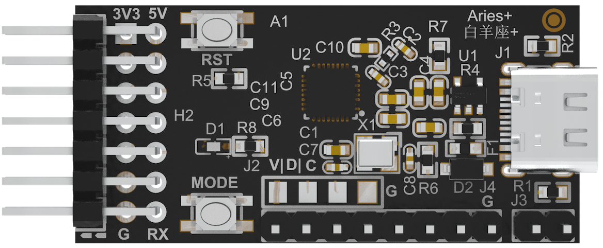

[中文](https://github.com/WeCanSTU/AriesPlus/blob/main/README_CN.md) / [English](https://github.com/WeCanSTU/AriesPlus/blob/main/README.md)

# Introduction to Aries Plus

## Overview

  
  
<em>Figure 1: Overview of Aries Plus</em>

Aries Plus is an efficient and practical bridging tool launched by WeCanSTU, designed to connect PCs to target development boards. It is compatible with various operating systems and MCU architectures. With its compact size (50mm x 20mm x 1mm) and plug-and-play driver-free design, Aries Plus is an ideal choice for students, engineers, and DIY enthusiasts for rapid development and debugging. It offers a low-cost, efficient, and secure solution that supports remote assistance for sample validation, problem-solving, and ensures comprehensive security in firmware development.

## Hardware Features

- **Compact Design**: Only 50mm x 20mm x 1mm, suitable for various development environments.
- **Robust Design**: Stable PCB design supports long-term operation.
- **Flexible Expansion**: Pre-configured SPI, PWM, and ADC interfaces provide a solid foundation for future functionality expansions, offering potential for further upgrades and flexibility.

  
  
<em>Figure 2: Front View of Aries Plus</em>

## Interface and Pin Functions

Aries Plus offers a rich interface design that supports various communication methods and hardware function expansions:

- **Type-C Interface**
  - Supports plug-and-play driver-free mode and high-speed data transfer.

- **Target Interface**
  - **5V, 3V3**: Voltage output.
  - **SDA/SCL**: Data/clock signal pins for I2C communication with the target development board.
  - **BOOT**: Aries Plus upgrade pin.
  - **MODE**: Matches the functionality of the MODE button on the Aries Plus board.
  - **MCU_RST**: Connected to the reset pin of the target development board chip.
  - **RST**: Matches the functionality of the RST button on the Aries Plus board.
  - **RX/TX**: Receive and transmit pins for the general USB-CDC physical serial interface.
  - **GND**: Ground.

  
  
<em>Figure 3: Back View of Aries Plus</em>

## Function Reserve Interface

- **SPI**
- **PWM**
- **ADC4**

## Buttons and Other Interfaces

- **RST Button**: Quickly reset the system.
- **MODE Button**: Switch between normal/DFU mode of the target development board.

## Functional Roles

- **Bridging Tool**: Connects the PC via USB interface and communicates with the development board through I2C, enabling efficient data transfer and debugging.
- **Multi-Platform Compatibility**: Paired with TechSync software, Aries Plus can run seamlessly on Windows, macOS, and Ubuntu systems, enabling cross-platform device management.
- **Real-Time Collaboration and Upgrades**: The combination of Aries Plus and TechSync software supports local and remote DFU upgrades, as well as real-time monitoring and debugging by multiple users, greatly improving team collaboration efficiency.
- **Multi-Purpose Communication**: Supports UART and I2C protocols, meeting diverse development needs.
- **Chip Independence**: Compatible with various chip architectures, reducing the complexity of repeated learning and the cost of purchasing multiple development tools.

## Advantages

- **Driver-Free Design**: Plug and play, no need for additional driver installation.
- **High Compatibility**: Supports various MCU architectures and chip manufacturers.
- **Reduced Development Cost**: Single hardware supports multi-platform and multi-chip development.
- **Efficient Communication**: Supports high-speed data transfer up to 400Kbps with the target board.
- **Full-Process Support**: From development to online updates, simple and fast.

## Technical Support and Resources
- **Supporting Software**: The upcoming TechSync software will provide users with comprehensive device management functionality, significantly improving development efficiency.
- **Developer Resources**: We are actively updating documentation and tutorials, and will subsequently provide detailed user guides and examples to help developers quickly get started and fully utilize the potential of Aries Plus.

## Resources and Support

- **Forum**: [Aries Plus Forum](https://forum.umetav.cn/t/aries-plus)  
  Open hours: Daily from 8 AM to 1 AM (Beijing Time).
- **QQ Group**: 786239575
- **Technical Support Email**: [tech@umetav.cn](mailto:tech@umetav.cn)

We are committed to providing continuous support and abundant resources for Aries Plus users. Please stay tuned for updates to get the latest information and support. If you have any questions or suggestions, please contact us through the above channels for more information or technical support.
