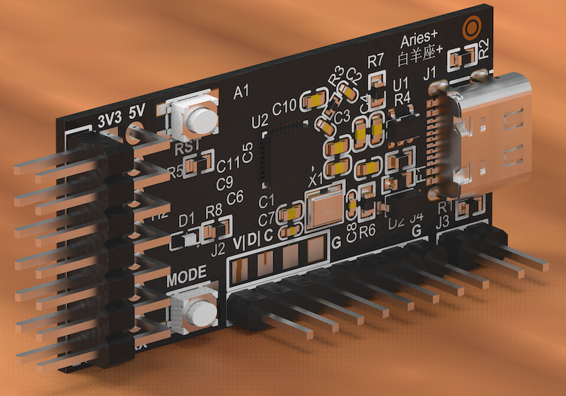
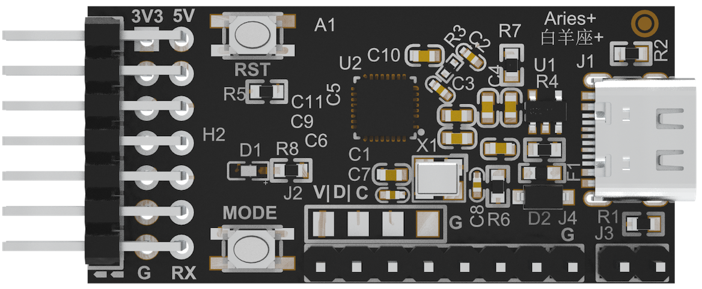
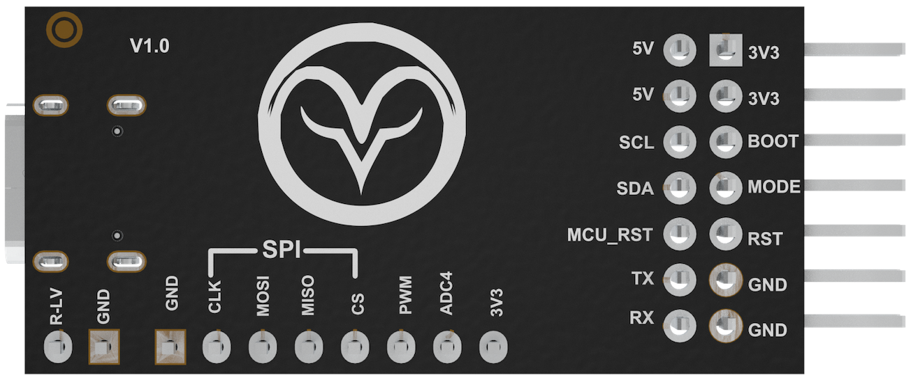

[中文](https://github.com/WeCanSTU/AriesPlus/blob/main/README_CN.md) / [English](https://github.com/WeCanSTU/AriesPlus/blob/main/README.md)

# Aries Plus 介绍

## 概述

  
  
<em>图1：Aries Plus产品概览</em>

Aries Plus 是由 WeCanSTU 推出的高效实用的桥接工具，设计用于将 PC 连接到目标开发板。它兼容各种操作系统和 MCU 架构。凭借其紧凑的尺寸（50mm x 20mm x 1mm）和即插即用的免驱设计，Aries Plus 是学生、工程师和 DIY 爱好者进行快速开发和调试的理想选择。它提供低成本、高效和安全的解决方案，支持远程协助进行样品验证、问题解决，并确保固件开发的全面安全。

## 硬件特点

- **紧凑设计**：仅50mm x 20mm x 1mm，适合多种开发环境。
- **坚固设计**：稳定的 PCB 设计，支持长期运行。
- **灵活扩展**：预配置的 SPI、PWM、ADC 接口为未来功能扩展提供了坚实的基础，提供进一步升级的潜力和灵活性。

  
  
<em>图2：Aries Plus前视图</em>

## 接口及引脚功能

Aries Plus 提供丰富的接口设计，支持多种通讯方式和硬件功能扩展：

- **Type-C 接口**
  - 支持即插即用免驱模式和高速数据传输。

- **目标接口**
  - **5V, 3V3**：电压输出。
  - **SDA/SCL**：用于与目标开发板进行 I2C 通信的数据/时钟信号引脚。
  - **BOOT**：Aries Plus 升级引脚。
  - **MODE**：与 Aries Plus 板上的 MODE 按钮功能匹配。
  - **MCU_RST**：连接到目标开发板芯片的复位引脚。
  - **RST**：与 Aries Plus 板上的 RST 按钮功能匹配。
  - **RX/TX**：通用 USB-CDC 物理串行接口的接收和发送引脚。
  - **GND**：接地。

  
  
<em>图3：Aries Plus背面视图</em>

## 功能预留接口

- **SPI**
- **PWM**
- **ADC4**

## 按钮和其他接口

- **RST 按钮**：快速重置系统。
- **MODE 按钮**：在目标开发板的正常/DFU 模式之间切换。

## 功能角色

- **桥接工具**：通过 USB 接口连接 PC，并通过 I2C 与开发板通信，实现高效的数据传输和调试。
- **多平台兼容性**：与 TechSync 软件配对，Aries Plus 可在 Windows、macOS 和 Ubuntu 系统上无缝运行，实现跨平台设备管理。
- **实时协作和升级**：Aries Plus 和 TechSync 软件的组合支持本地和远程 DFU 升级，以及由多个用户进行的实时监控和调试，大大提高团队协作效率。
- **多用途通信**：支持 UART 和 I2C 协议，满足多样化的开发需求。
- **芯片独立性**：兼容各种芯片架构，降低重复学习的复杂性和购买多种开发工具的成本。

## 优势

- **免驱设计**：即插即用，无需额外安装驱动程序。
- **高兼容性**：支持多种 MCU 架构和芯片制造商。
- **降低开发成本**：单一硬件支持多平台和多芯片开发。
- **高效通信**：支持与目标板进行高达 400Kbps 的高速数据传输。
- **全流程支持**：从开发到在线更新，简单快速。

## 技术支持和资源
- **配套软件**：即将推出的 TechSync 软件将为用户提供全面的设备管理功能，显著提升开发效率。
- **开发者资源**：我们正在积极更新文档和教程，随后将提供详细的用户指南和示例，帮助开发者快速入门并充分利用 Aries Plus 的潜力。

## 资源和支持

- **论坛**：[Aries Plus 论坛](https://forum.umetav.cn/t/aries-plus)  
  开放时间：每天早上8点至凌晨1点（北京时间）。
- **QQ群**：786239575
- **技术支持邮箱**：[tech@umetav.cn](mailto:tech@umetav.cn)

我们致力于为 Aries Plus 用户提供持续的支持和丰富的资源。请关注更新以获取最新的信息和支持。如果您有任何问题或建议，请通过上述渠道联系我们以获取更多信息或技术支持。
